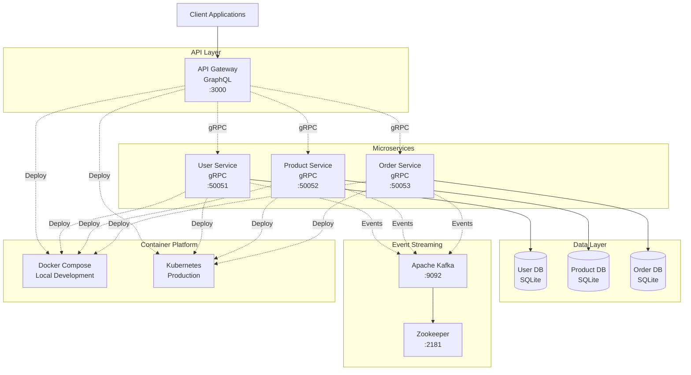
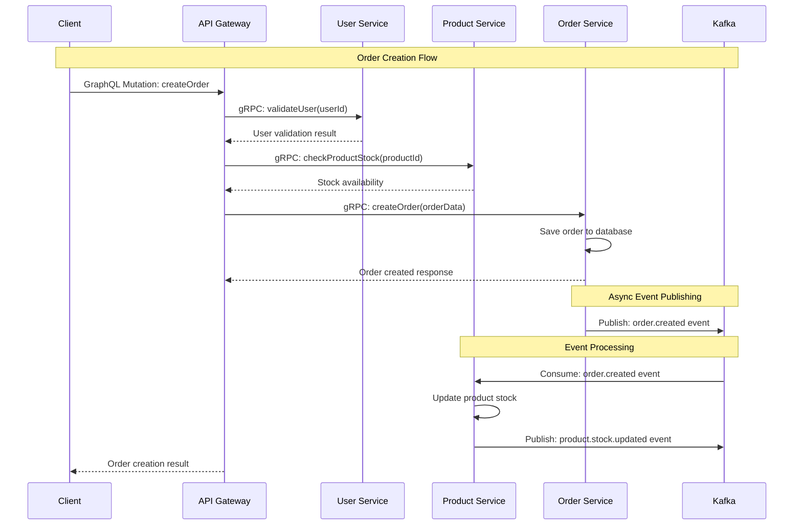

# Microservices Architecture with NestJS

A comprehensive microservices solution built with NestJS, GraphQL, gRPC, and Kafka, designed for scalability and maintainability.

## 🏗️ Architecture Overview

This project implements a microservices architecture with the following components:

- **API Gateway**: GraphQL federation layer
- **User Service**: User management microservice
- **Product Service**: Product catalog microservice  
- **Order Service**: Order processing microservice
- **Message Broker**: Apache Kafka for event streaming
- **Container Orchestration**: Kubernetes deployment

### 🎯 Architecture Diagram



### 📊 Service Communication Flow

```
┌─────────────┐    GraphQL     ┌─────────────────┐
│   Client    │ ──────────────▶│   API Gateway   │
│ Application │                │   (Port 3000)   │
└─────────────┘                └─────────────────┘
                                        │
                                     gRPC
                          ┌─────────────┼─────────────┐
                          │             │             │
                          ▼             ▼             ▼
                ┌─────────────┐ ┌─────────────┐ ┌─────────────┐
                │User Service │ │Product Svc  │ │Order Service│
                │(Port 50051) │ │(Port 50052) │ │(Port 50053) │
                └─────────────┘ └─────────────┘ └─────────────┘
                        │             │             │
                        │             │             │ Async Events
                        └─────────────┼─────────────┘
                                      ▼
                              ┌─────────────┐
                              │Apache Kafka │
                              │(Port 9092)  │
                              └─────────────┘
```

### 🔄 Data Flow Architecture

```
┌─────────────────────────────────────────────────────────────────┐
│                        API Gateway (GraphQL)                    │
│  ┌─────────────┐  ┌─────────────┐  ┌─────────────────────────┐  │
│  │User Resolver│  │Product      │  │Order Resolver           │  │
│  │             │  │Resolver     │  │                         │  │
│  └─────────────┘  └─────────────┘  └─────────────────────────┘  │
└──────┬───────────────────┬────────────────────┬─────────────────┘
       │                   │                    │
      gRPC                gRPC                 gRPC
       │                   │                    │
┌──────▼──────┐    ┌───────▼──────┐    ┌────────▼────────┐
│User Service │    │Product       │    │Order Service    │
│             │    │Service       │    │                 │
│┌───────────┐│    │┌────────────┐│    │┌───────────────┐│
││User       ││    ││Product     ││    ││Order          ││
││Controller ││    ││Controller  ││    ││Controller     ││
│└───────────┘│    │└────────────┘│    │└───────────────┘│
│┌───────────┐│    │┌────────────┐│    │┌───────────────┐│
││User       ││    ││Product     ││    ││Order          ││
││Service    ││    ││Service     ││    ││Service        ││
│└───────────┘│    │└────────────┘│    │└───────────────┘│
│┌───────────┐│    │┌────────────┐│    │┌───────────────┐│
││User       ││    ││Product     ││    ││Order          ││
││Entity     ││    ││Entity      ││    ││Entity         ││
│└───────────┘│    │└────────────┘│    │└───────────────┘│
└─────────────┘    └──────────────┘    └─────────────────┘
       │                   │                     │
       ▼                   ▼                     ▼
┌─────────────┐    ┌──────────────┐    ┌─────────────────┐
│SQLite       │    │SQLite        │    │SQLite           │
│users.db     │    │products.db   │    │orders.db        │
└─────────────┘    └──────────────┘    └─────────────────┘
```

### 🚀 Deployment Architecture

#### Local Development (Docker Compose)
```
┌─────────────────────────────────────────────────────────────────┐
│                        Docker Host                              │
│                                                                 │
│  ┌─────────────┐  ┌─────────────┐  ┌─────────────────────────┐  │
│  │API Gateway  │  │User Service │  │Product Service          │  │
│  │Container    │  │Container    │  │Container                │  │
│  │:3000        │  │:50051       │  │:50052                   │  │
│  └─────────────┘  └─────────────┘  └─────────────────────────┘  │
│                                                                 │
│  ┌─────────────┐  ┌─────────────┐  ┌─────────────────────────┐  │
│  │Order Service│  │Kafka        │  │Zookeeper                │  │
│  │Container    │  │Container    │  │Container                │  │
│  │:50053       │  │:9092        │  │:2181                    │  │
│  └─────────────┘  └─────────────┘  └─────────────────────────┘  │
│                                                                 │
│  ┌─────────────────────────────────────────────────────────┐    │
│  │                ms_default Network                       │    │
│  └─────────────────────────────────────────────────────────┘    │
└─────────────────────────────────────────────────────────────────┘
```

#### Production Deployment (Kubernetes)
```
┌────────────────────────────────────────────────────────────────┐
│                    Kubernetes Cluster                          │
│                                                                │
│  ┌─────────────────────────────────────────────────────────┐   │
│  │                  microservices namespace                │   │
│  │                                                         │   │
│  │  ┌─────────────┐    ┌─────────────┐                     │   │
│  │  │API Gateway  │    │User Service │                     │   │
│  │  │Deployment   │    │Deployment   │                     │   │
│  │  │Replicas: 2  │    │Replicas: 2  │                     │   │
│  │  └─────────────┘    └─────────────┘                     │   │
│  │                                                         │   │
│  │  ┌─────────────┐    ┌─────────────┐                     │   │
│  │  │Product Svc  │    │Order Service│                     │   │
│  │  │Deployment   │    │Deployment   │                     │   │
│  │  │Replicas: 2  │    │Replicas: 2  │                     │   │
│  │  └─────────────┘    └─────────────┘                     │   │
│  │                                                         │   │
│  │  ┌─────────────┐    ┌─────────────┐                     │   │
│  │  │Kafka        │    │Zookeeper    │                     │   │
│  │  │Deployment   │    │Deployment   │                     │   │
│  │  │Replicas: 1  │    │Replicas: 1  │                     │   │
│  │  └─────────────┘    └─────────────┘                     │   │
│  │                                                         │   │
│  │  ┌───────────────────────────────────────────────────┐  │   │
│  │  │                Services & Ingress                 │  │   │
│  │  │                                                   │  │   │
│  │  │  LoadBalancer ──▶ API Gateway Service             │  │   │
│  │  │  ClusterIP ────▶ Microservice Services            │  │   │
│  │  └───────────────────────────────────────────────────┘  │   │
│  └─────────────────────────────────────────────────────────┘   │
└────────────────────────────────────────────────────────────────┘
```

### 🔧 Technology Stack Diagram

```
┌─────────────────────────────────────────────────────────────────┐
│                       Technology Stack                          │
├─────────────────────────────────────────────────────────────────┤
│ Frontend Layer                                                  │
│ ┌─────────────┐ ┌─────────────┐ ┌─────────────────────────────┐ │
│ │Web Apps     │ │Mobile Apps  │ │Third-party Integrations     │ │
│ │React/Vue    │ │React Native │ │REST/GraphQL Clients         │ │
│ └─────────────┘ └─────────────┘ └─────────────────────────────┘ │
├─────────────────────────────────────────────────────────────────┤
│ API Gateway Layer                                               │
│ ┌─────────────────────────────────────────────────────────────┐ │
│ │GraphQL API Gateway (NestJS + Apollo Server)                 │ │
│ │• Schema Federation • Authentication • Rate Limiting         │ │
│ └─────────────────────────────────────────────────────────────┘ │
├─────────────────────────────────────────────────────────────────┤
│ Microservices Layer                                             │
│ ┌─────────────┐ ┌─────────────┐ ┌─────────────────────────────┐ │
│ │User Service │ │Product Svc  │ │Order Service                │ │
│ │NestJS+gRPC  │ │NestJS+gRPC  │ │NestJS+gRPC                  │ │
│ │TypeORM      │ │TypeORM      │ │TypeORM                      │ │
│ └─────────────┘ └─────────────┘ └─────────────────────────────┘ │
├─────────────────────────────────────────────────────────────────┤
│ Event Streaming Layer                                           │
│ ┌─────────────────────────────────────────────────────────────┐ │
│ │Apache Kafka + Zookeeper                                     │ │
│ │• Event Sourcing • Async Communication • Data Consistency    │ │
│ └─────────────────────────────────────────────────────────────┘ │
├─────────────────────────────────────────────────────────────────┤
│ Data Layer                                                      │
│ ┌─────────────┐ ┌─────────────┐ ┌─────────────────────────────┐ │
│ │SQLite       │ │SQLite       │ │SQLite                       │ │
│ │users.db     │ │products.db  │ │orders.db                    │ │
│ └─────────────┘ └─────────────┘ └─────────────────────────────┘ │
├─────────────────────────────────────────────────────────────────┤
│ Infrastructure Layer                                            │
│ ┌─────────────┐ ┌─────────────┐ ┌─────────────────────────────┐ │
│ │Docker       │ │Kubernetes   │ │Development Tools            │ │
│ │Containers   │ │Orchestration│ │Lerna, TypeScript, Jest      │ │
│ └─────────────┘ └─────────────┘ └─────────────────────────────┘ │
└─────────────────────────────────────────────────────────────────┘
```

### 📈 Event Flow Diagram



### 🔄 gRPC Service Interaction

```
                    API Gateway (GraphQL)
                           │
                     ┌─────┼─────┐
                     │     │     │
                  gRPC   gRPC   gRPC
                     │     │     │
                     ▼     ▼     ▼
            ┌─────────────────────────────────────┐
            │         Service Mesh                │
            │                                     │
            │  ┌─────────┐ ┌─────────┐ ┌─────────┐│
            │  │  User   │ │Product  │ │ Order   ││
            │  │Service  │ │Service  │ │Service  ││
            │  │:50051   │ │:50052   │ │:50053   ││
            │  └─────────┘ └─────────┘ └─────────┘│
            └─────────────────────────────────────┘
                     │     │     │
                Event│  Evt│  Evt│Streams
                     ▼     ▼     ▼
            ┌─────────────────────────────────────┐
            │           Apache Kafka              │
            │                                     │
            │  Topics:                            │
            │  • user.created                     │
            │  • user.updated                     │
            │  • product.created                  │
            │  • product.stock.updated            │
            │  • order.created                    │
            │  • order.status.changed             │
            └─────────────────────────────────────┘
```

## 📁 Project Structure

```
├── services/
│   ├── api-gateway/          # GraphQL API Gateway
│   ├── user-service/         # User management service
│   ├── product-service/      # Product catalog service
│   └── order-service/        # Order processing service
├── libs/
│   └── proto/               # Shared gRPC protocol definitions
├── k8s/                     # Kubernetes manifests
├── docker-compose.yml       # Local development setup
└── lerna.json              # Monorepo configuration
```

## 🛠️ Getting Started

### Prerequisites

- Node.js 18+
- Docker & Docker Compose
- Kubernetes (optional, for production deployment)

### Local Development

1. **Install dependencies:**
   ```bash
   npm install
   npx lerna bootstrap
   ```

2. **Start services with our development script:**
   ```bash
   npm run dev:start
   ```
   This will:
   - Start Kafka and Zookeeper via Docker
   - Launch all microservices with proper delays
   - Create log files for each service in `/tmp/`
   - Display service URLs and process IDs

3. **Alternative: Start with Docker Compose only:**
   ```bash
   npm run docker:up
   ```

4. **Stop all services:**
   ```bash
   npm run dev:stop
   ```

### Service Endpoints

- **API Gateway**: http://localhost:3000/graphql
- **User Service**: gRPC on port 50051
- **Product Service**: gRPC on port 50052
- **Order Service**: gRPC on port 50053
- **Kafka**: localhost:9092
- **Zookeeper**: localhost:2181

### Troubleshooting

**Port already in use errors:**
```bash
# Stop all services and free ports
npm run dev:stop

# Check if ports are free
lsof -i:3000 && lsof -i:50051 && lsof -i:50052 && lsof -i:50053

# If still occupied, manually kill processes
sudo lsof -ti:3000 | xargs kill -9
```

**Check service logs:**
```bash
# View real-time logs
tail -f /tmp/api-gateway.log
tail -f /tmp/user-service.log
tail -f /tmp/product-service.log
tail -f /tmp/order-service.log

# View all logs at once
ls /tmp/*-service.log /tmp/api-gateway.log | xargs tail -f
```

**Service won't start:**
```bash
# Check if dependencies are installed
cd services/api-gateway && npm install
cd services/user-service && npm install
cd services/product-service && npm install
cd services/order-service && npm install

# Rebuild all services
npm run build
```

## 🔧 Available Scripts

```bash
# Development
npm run dev:start          # Start all services with proper sequencing and logging
npm run dev:stop           # Stop all services and clean up ports/logs
npm run build              # Build all services
npm run test               # Run tests for all services

# Individual service management (alternative)
npm run start:dev          # Start all services in parallel (lerna)
npm run start:prod         # Start all services in production mode

# Docker
npm run docker:build       # Build Docker images
npm run docker:up          # Start services with Docker Compose
npm run docker:down        # Stop Docker services

# Kubernetes
npm run k8s:apply          # Deploy to Kubernetes
npm run k8s:delete         # Remove from Kubernetes

# Lerna monorepo commands
npm run bootstrap          # Install dependencies for all packages
npx lerna clean            # Clean all node_modules
npx lerna run build        # Build all packages
npx lerna run test         # Test all packages
```

## 📡 API Usage

### GraphQL Queries

The API Gateway exposes a unified GraphQL schema. Access the GraphQL Playground at `http://localhost:3000/graphql`.

#### Example Queries:

**Create a user:**
```graphql
mutation {
  createUser(name: "John Doe", email: "john@example.com", password: "password123") {
    id
    name
    email
    createdAt
  }
}
```

**Get all users:**
```graphql
query {
  users(page: 1, limit: 10) {
    id
    name
    email
    createdAt
  }
}
```

**Get a specific user:**
```graphql
query {
  user(id: "user-id-here") {
    id
    name
    email
    createdAt
  }
}
```

**Create a product:**
```graphql
mutation {
  createProduct(
    name: "Laptop"
    description: "High-performance laptop"
    price: 999.99
    stock: 50
    category: "Electronics"
  ) {
    id
    name
    price
    stock
  }
}
```

**Get products:**
```graphql
query {
  products(page: 1, limit: 10, category: "Electronics") {
    id
    name
    description
    price
    stock
    category
  }
}
```

**Create an order:**
```graphql
mutation {
  createOrder(
    userId: "user-id"
    items: [
      { productId: "product-id", quantity: 2, price: 29.99 }
    ]
    totalAmount: 59.98
  ) {
    id
    status
    totalAmount
    createdAt
  }
}
```

**Get user orders:**
```graphql
query {
  userOrders(userId: "user-id", page: 1, limit: 10) {
    id
    totalAmount
    status
    items {
      productId
      quantity
      price
    }
    createdAt
  }
}
```

## 🐳 Docker Deployment

The application includes Docker configurations for each service:

```bash
# Build and start all services
docker-compose up --build

# Scale specific services
docker-compose up --scale user-service=3 --scale product-service=2
```

## ☸️ Kubernetes Deployment

Deploy to Kubernetes cluster:

```bash
# Create namespace and deploy all services
kubectl apply -f k8s/

# Check deployment status
kubectl get pods -n microservices

# Access API Gateway
kubectl port-forward svc/api-gateway 3000:80 -n microservices
```

## 🔄 Event-Driven Architecture

The services communicate through:

1. **Synchronous**: gRPC for direct service-to-service communication
2. **Asynchronous**: Kafka for event streaming and loose coupling

### Kafka Topics

- `user.created` - User registration events
- `order.created` - New order events
- `product.updated` - Product catalog changes

## 🧪 Testing

```bash
# Run all tests
npm run test

# Run tests with coverage
npm run test:cov

# Run end-to-end tests
npm run test:e2e

# Run tests for specific service
cd services/user-service && npm test
cd services/product-service && npm test
cd services/order-service && npm test
cd services/api-gateway && npm test

# Watch mode for development
npm run test:watch
```

## 📁 Project Structure Details

```
├── services/
│   ├── api-gateway/          # GraphQL API Gateway (Port 3000)
│   │   ├── src/
│   │   │   ├── models/       # GraphQL type definitions
│   │   │   ├── resolvers/    # GraphQL resolvers
│   │   │   └── main.ts       # Entry point
│   │   └── Dockerfile
│   ├── user-service/         # User management (gRPC Port 50051)
│   │   ├── src/
│   │   │   ├── user/         # User module
│   │   │   │   ├── user.entity.ts
│   │   │   │   ├── user.service.ts
│   │   │   │   └── user.controller.ts
│   │   │   └── main.ts       # gRPC server setup
│   │   └── Dockerfile
│   ├── product-service/      # Product catalog (gRPC Port 50052)
│   └── order-service/        # Order processing (gRPC Port 50053)
├── libs/
│   └── proto/               # Shared gRPC protocol definitions
│       ├── user.proto
│       ├── product.proto
│       └── order.proto
├── k8s/                     # Kubernetes manifests
│   ├── kafka.yaml          # Kafka & Zookeeper deployment
│   ├── services.yaml       # Microservices deployments
│   └── api-gateway.yaml    # API Gateway deployment
├── scripts/                 # Development scripts
│   ├── dev-start.sh        # Start all services
│   └── dev-stop.sh         # Stop all services
├── docker-compose.yml       # Local development setup
├── lerna.json              # Monorepo configuration
└── package.json            # Root package configuration
```

## 📚 Development Guidelines

1. **Service Independence**: Each microservice should be independently deployable
2. **API First**: Define gRPC proto contracts before implementation
3. **Database per Service**: Each service manages its own data (SQLite for development)
4. **Event Sourcing**: Use Kafka for cross-service communication
5. **Health Checks**: Implement health endpoints for all services
6. **Logging**: Services log to `/tmp/[service-name].log` during development
7. **Port Management**: 
   - API Gateway: 3000
   - User Service: 50051 (gRPC)
   - Product Service: 50052 (gRPC)
   - Order Service: 50053 (gRPC)
   - Kafka: 9092
   - Zookeeper: 2181

## 🚀 Quick Start Guide

1. **Clone and setup:**
   ```bash
   git clone <repository-url>
   cd microservices-nestjs
   npm install
   npx lerna bootstrap
   ```

2. **Start development environment:**
   ```bash
   npm run dev:start
   ```

3. **Open GraphQL Playground:**
   - Navigate to http://localhost:3000/graphql
   - Try the example queries from the API Usage section

4. **Monitor services:**
   ```bash
   # Check if all services are running
   lsof -i:3000 && lsof -i:50051 && lsof -i:50052 && lsof -i:50053
   
   # View logs
   tail -f /tmp/api-gateway.log
   ```

5. **Stop when done:**
   ```bash
   npm run dev:stop
   ```

## 🔐 Security Considerations

- Implement JWT authentication in API Gateway
- Use TLS for gRPC communication in production
- Add rate limiting and input validation
- Secure Kafka with SASL/SSL
- Environment-specific configuration files
- Secrets management for production deployments

## 📈 Monitoring & Observability

Consider adding:
- Distributed tracing (Jaeger/Zipkin)
- Metrics collection (Prometheus)
- Centralized logging (ELK Stack)
- Health monitoring (Kubernetes health checks)
- Service mesh (Istio) for production

## 🔧 Common Issues & Solutions

**Services fail to start:**
```bash
# Check dependencies
npm run bootstrap
npm run build

# Clean and reinstall
npx lerna clean
npm install
npx lerna bootstrap
```

**GraphQL errors:**
```bash
# Check if API Gateway can reach gRPC services
telnet localhost 50051
telnet localhost 50052  
telnet localhost 50053
```

**Kafka connection issues:**
```bash
# Restart Kafka containers
docker-compose down
docker-compose up -d kafka zookeeper
```

**Database issues:**
- SQLite databases are created automatically in each service directory
- Delete `.db` files to reset databases
- Check TypeORM configuration in each service's `app.module.ts`

## 🤝 Contributing

1. Fork the repository
2. Create a feature branch
3. Make your changes
4. Add tests for new functionality
5. Submit a pull request

## 📄 License

This project is licensed under the MIT License.

---

For detailed service documentation, see the README files in each service directory.
